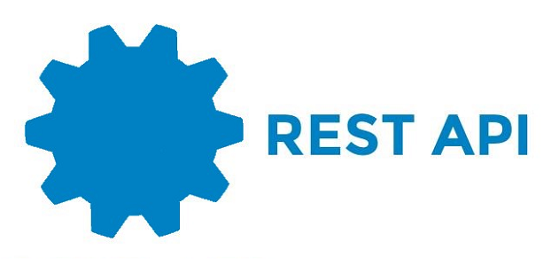
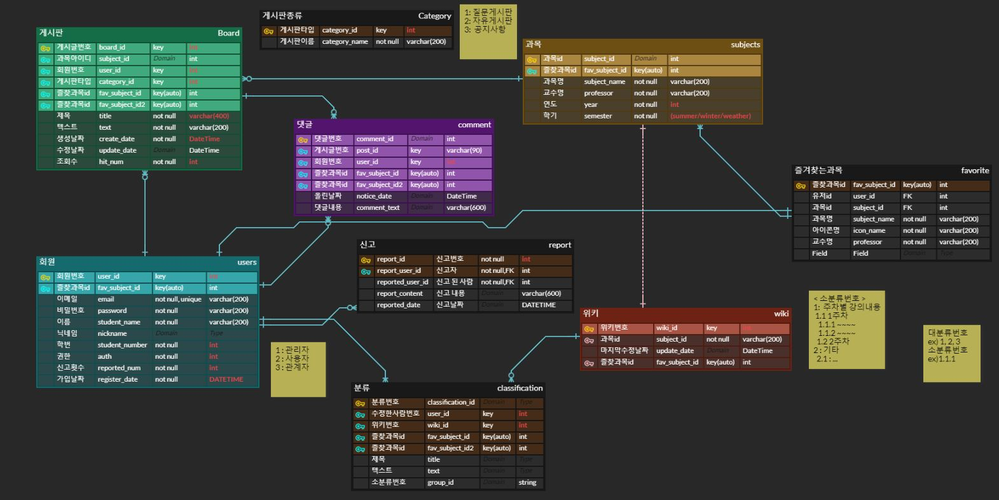

## wiki-back

위키백과 기반 대학생들을 위한 온라인 강의 공유 플랫폼 wings-wiki 백엔드 작업
[`wings-wiki`] 의 백엔드 코드입니다.

## Introduce

수업 내용을 함께 만들어 나가요.

  
  
  
  

## Author

추가할 거 있으면 메일 보내주세요.

[API 명세서] https://www.notion.so/9dd4c906891945029f2ad4a2affd0596
[ERD_DIAGRAM]

  

[Sujin](https://github.com/SujinJeong)
- Blog : https://blog.naver.com/lovesujin051
- E-mail : lovesujin05173@gmail.com
